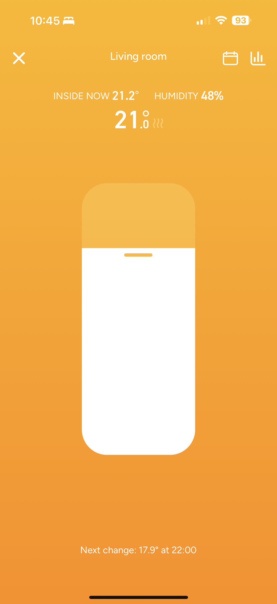

# Sentiment Slider Design System Component

Welcome to the documentation for the Sentiment Slider component. This component is part of our design system and provides an intuitive, visually appealing way for users to express their sentiments.

## Table of Contents

- [Component Overview](SentimentSlider.md)
- [Technical Documentation](SentimentSlider.technical.md)
- [Example Implementation](examples/SentimentSliderExample.tsx)

## Quick Start

To integrate the Sentiment Slider into your project:

1. Import the component:
```tsx
import { SentimentSlider } from '@/components/SentimentSlider';
```

2. Add it to your component:
```tsx
function MyComponent() {
  const handleFeedbackSubmit = () => {
    console.log('User submitted feedback');
    // Handle the next step in your flow
  };

  return (
    <div className="my-container">
      <h1>We value your feedback</h1>
      <SentimentSlider onConfirm={handleFeedbackSubmit} />
    </div>
  );
}
```

3. Visit the [Component Overview](SentimentSlider.md) for more details on props and configuration.

## Screenshots



## Component Files

The Sentiment Slider is composed of these files:

- `components/SentimentSlider.tsx`: The main component implementation
- `hooks/use-sentiment.ts`: Custom hook for managing sentiment state
- `lib/utils.ts`: Utility functions for color calculations and animations

## Integration Guide

For a complete implementation example, see the [Example Implementation](examples/SentimentSliderExample.tsx).

## Design Principles

This component was built with these principles in mind:

1. **Intuitive Interaction**: The slider should feel natural and obvious to use
2. **Visual Delight**: Animations and color transitions should create moments of joy
3. **Emotional Expression**: The component should reflect the user's emotional state
4. **Mobile-First**: The design prioritizes touch interactions on mobile devices
5. **Accessibility**: The component maintains good contrast and includes text labels

## Further Reading

For detailed implementation notes and internal mechanics, refer to the [Technical Documentation](SentimentSlider.technical.md).